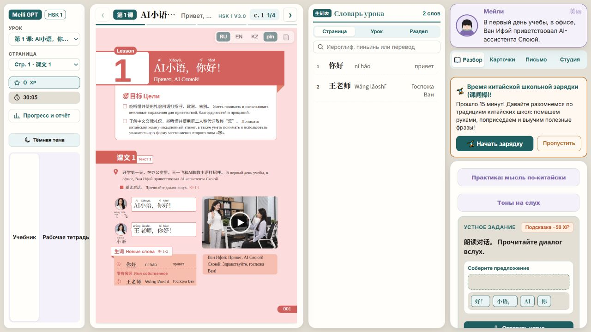
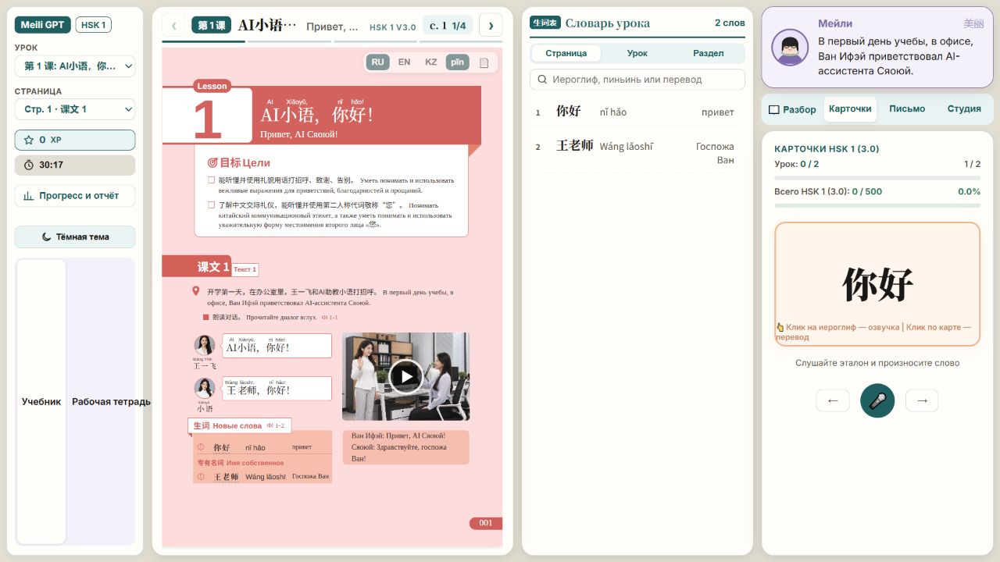
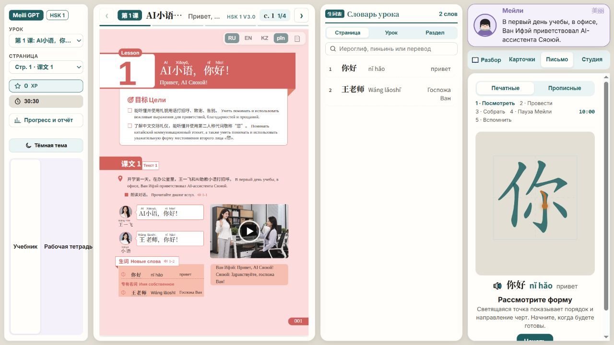
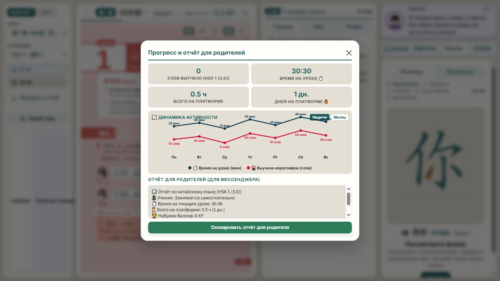
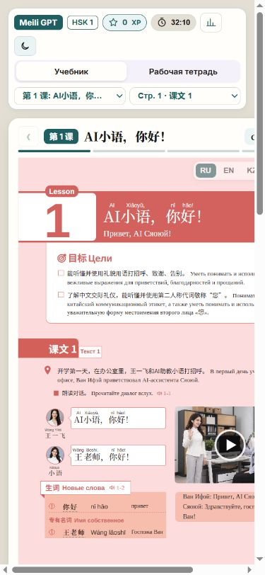

# Пересмотр дизайна Meili GPT

5 октября 2026 года · Product Design · только учебная платформа.

## Вывод

У платформы уже есть полезная основа: настоящий учебник, связанный с ним словарь, карточки, письмо и помощник. Главная проблема — распределение внимания и места. На настольном экране четыре вертикальные зоны одновременно; учебник и упражнения сжаты, хотя словарь часто почти пустой. На мобильном экране часть страницы выходит за границы. Отчёт о прогрессе показывает неподтверждённые достижения.

Рекомендуемое направление: «Учебник в центре». Сохранить кремовый фон, бирюзовый акцент и исходные страницы книги. Сделать обучение последовательным: читать → разбирать → практиковаться → вспоминать. Не превращать учебный интерфейс в витрину функций.

## Проверенные шаги

### 1. Урок — работает, но чтение затруднено

Сильные стороны: урок и страница доступны, словарь связан с текущим текстом, языковые переключатели рядом с книгой.

Проблемы: при экране 1280 × 720 книга занимает около трети ширины; основной текст очень мелкий. В словаре всего два слова, но ему выделена целая колонка. Название урока обрезано. Переключатель «Учебник / Рабочая тетрадь» растягивается почти на всю высоту левой панели. Баннер зарядки конкурирует с текущим заданием.

Изменение: дать книге большую центральную область; словарь открывать по запросу или показывать компактно. Уменьшить высоту переключателя книг и вернуть его к выбору урока. Свернуть необязательные напоминания.

### 2. Карточки — работают, но практика зажата

Сильные стороны: слово крупное, есть озвучка, перевод, оценка сложности и переход между словами.

Проблемы: карточка находится в узкой боковой колонке, тогда как книга и почти пустой словарь продолжают занимать большую часть экрана. Подсказка на карточке мелкая и переносится. Смешаны показатели текущего урока и всей программы HSK.

Изменение: по выбору режима «Карточки» выделять практике центральную область, оставляя компактную связь с уроком. Развести «Слова этого урока» и «Вся программа». Заменить инструкции про клики ясными подписями и доступными с клавиатуры действиями.

### 3. Письмо — работает, но требует большего поля

Сильные стороны: порядок черт, визуальное изучение формы, этапы самостоятельного воспроизведения. Печатные и прописные формы разделены.

Проблемы: поле практики располагается в узкой колонке. Этапы обучения переносятся на несколько строк, действие «Начать» уходит к нижней границе и требует прокрутки. Ученик продолжает видеть три параллельные задачи вместо одного упражнения.

Изменение: открыть письмо как основной рабочий режим с большим полем, короткой инструкцией и видимой основной кнопкой. Сохранить существующую последовательность моторной практики и отдельный режим прописных.

### 4. Прогресс — открывается, но данные вводят в заблуждение

Сильные стороны: отчёт можно скопировать, время и число освоенных слов видны.

Проблемы: при 0 освоенных слов и 0 XP график показывает достижения за неделю. Текст отчёта уже утверждает, что упражнения успешно пройдены и прогресс отличный. Это не просто визуальная проблема: пользователь получает неподтверждённую оценку.

Подтверждение в текущем коде: `renderProgressLineChart()` использует фиксированные массивы данных; обработчик кнопки `openParentModalBtn` формирует положительный статус без проверки результатов упражнений.

Изменение: показывать только измеренные результаты; до появления истории — честное состояние «История занятий пока не накоплена». Отделить «время открытой страницы» от подтверждённого результата обучения. Не использовать демонстрационные числа в отчёте ученика.

### 5. Мобильный урок — есть обрезание и горизонтальная прокрутка

Проверка: область просмотра 390 × 844; измеренная ширина содержимого 477 px, ширина учебной панели около 465 px. Справа обрезаются навигация и учебные материалы. До практики необходимо прокручивать книгу и словарь.

Изменение: одна рабочая область на экране, компактные переключатели режимов, панель словаря по запросу. Внешняя оболочка не должна выходить за ширину телефона. Если исходной странице книги нужен масштаб, его управление должно быть отдельным и явным. Не менять геометрию печатной страницы ради адаптации оболочки.

## Приоритеты

1. **Критично:** убрать неподтверждённые достижения из прогресса и отчёта.
2. **Высокий:** исправить обрезание мобильного интерфейса.
3. **Высокий:** дать книге, карточкам и письму собственные полноценные режимы.
4. **Средний:** компактная навигация, ясные названия, видимая следующая задача.
5. **Средний:** проверить фокус клавиатуры, названия и размеры кнопок, контраст второстепенного текста.

## Три направления для следующего этапа

- **Учебник в центре — рекомендуемое.** Основной экран посвящён чтению. Словарь и Мейли доступны рядом по запросу. Карточки и письмо становятся полноценными рабочими режимами. Лучше всего сохраняет существующую ценность исходного учебника.
- **Последовательное занятие.** Один шаг за раз: прочитать диалог, разобрать слова, произнести, написать, вспомнить. Подходит новичкам, которым важнее ясная следующая задача. Потребует изменения организации упражнения, а не только оформления.
- **Панель преподавателя и ученика.** Свободное переключение между книгой, практикой и проверенными результатами. Больше возможностей для опытного пользователя; выше риск снова перегрузить первый экран. Следует разделять учебный режим и настройки.

Это структурные направления, а не готовые макеты или внесённые изменения интерфейса.

## Границы проверки

Проверены локальные экраны платформы, переходы в карточки и письмо, открытие и закрытие отчёта, а также мобильная ширина. Снимки получены в этом сеансе и проверены после сохранения. API-ключи не вводились; генерация, оценка речи и платные AI-вызовы не проверялись. Полный аудит клавиатуры и экранного диктора не выполнялся; соответствие стандартам доступности не заявляется.

Исходные страницы учебника не редактировались. Код учебной платформы и FS в этом этапе не менялся. Все материалы разбора находятся в `D:\Meili GPT\design-review`.

Следующий этап: разработать визуальный макет «Учебник в центре», сохранив исходные страницы и существующие учебные сценарии.
